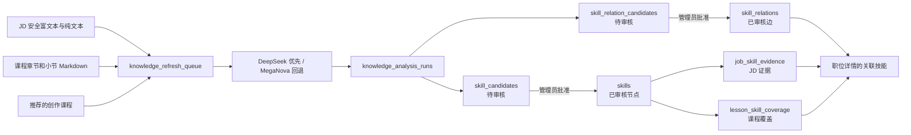

# StudyAI Now 知识技能图谱：技术与审查手册

## 1. 定位与边界

本项目将“图数据库”实现为 Cloudflare D1 中的**有向属性图模型**，而不是另行运行 Neo4j、TigerGraph 等图数据库：

- `skills` 是已审核的技能节点；
- `skill_relations` 是已审核的有向技能关系边；
- `job_skill_evidence` 与 `lesson_skill_coverage` 是分别连接 JD、课程内容与技能的已审核证据；
- `course_knowledge_sources` 保存每个公开课程章节概览及小节的源语言 Markdown 索引，正文位于 R2；
- LLM 输出先进入候选层，绝不直接成为节点、边或公开页面内容。

这样保留 D1 的事务、外键、审计与 Cloudflare Worker 的低运维优势，同时满足当前技能图谱的查询模式。以后当跨多跳图算法、超大规模边遍历或专门图分析成为瓶颈时，可从已审核的 `skills` / `skill_relations` 导出到专用图引擎；目前不需要双写。



## 2. 图模型与表结构

| 层级 | D1 表 | 含义 | 何时公开 |
| --- | --- | --- | --- |
| 节点 | `skills` | 规范技能、别名、分类、难度 | `status = 'approved'` |
| 关系边 | `skill_relations` | `from_skill_id -> to_skill_id` 的有向关系 | `status = 'approved'` |
| JD 证据 | `job_skill_evidence` | 技能在特定 JD 版本、段落与字符偏移处的证据 | `review_status in ('approved', 'edited')` |
| 课程覆盖 | `lesson_skill_coverage` | 技能与课程/章节/小节的覆盖强度和学习结果 | `review_status = 'approved'` |
| 课程源索引 | `course_knowledge_sources` | 公开课程的章节概览和小节，以及其 R2 对象哈希 | 永不直接公开 |
| 待分析来源 | `knowledge_refresh_queue` | JD 版本、课程章节或创作课程的哈希去重队列 | 永不公开 |
| 分析审计 | `knowledge_analysis_runs` | 模型、提示词版本、输入量、输出或错误 | 仅管理员 |
| 技能候选 | `skill_candidates` | LLM 提议的新技能或已有技能映射 | 仅管理员 |
| 关系候选 | `skill_relation_candidates` | LLM 提议的技能关系 | 仅管理员 |

### 节点

`skills.id` 是稳定主键，`skills.slug` 唯一。`name_zh`、`name_en`、`definition`、`category` 与 `difficulty` 由管理员审核后保存。`parent_id` 为未来的技能层级保留，不会把“关系”误编码成层级。

### 边

`skill_relations` 的唯一键为 `(from_skill_id, to_skill_id, relation_type)`，并强制禁止自环。允许的 `relation_type`：

- `related_to`：强相关，但无方向上的依赖主张；仍使用有向存储以保留出处。
- `prerequisite_of`：`from` 是学习或掌握 `to` 的前置知识。
- `part_of`：`from` 是 `to` 的组成部分。
- `co_required_with`：两个概念通常应一起掌握。
- `alternative_to`：在指定语境下的替代方案。

`weight` 表示关系强度，`confidence` 表示模型/审核证据置信度，范围均为 `0–1`。所有公开查询只读取 `status = 'approved'` 的边。

### JD 与课程不是“无证据关系”

JD 技能证据至少包含 `job_id`、`version_id`、`section_id`、`start_offset`、`end_offset` 与引用文本；课程覆盖包含课程、章节、小节、覆盖等级、评分和学习结果。它们是可追溯的事实连接，不能由仅仅相似的词汇替代。

## 3. 数据生命周期与安全规则

1. JD 安全富文本转换产生标准纯文本；课程从 `course_knowledge_sources` 逐个读取受控 R2 Markdown。长章节不会截断后续小节。
2. 内容哈希写入 `knowledge_refresh_queue`，同一 `(source_type, source_id, source_hash)` 不重复入队。
3. Worker 使用 DeepSeek V4-Pro；失败才使用 MegaNova，要求严格 JSON。DeepSeek 使用 JSON 模式、非思考模式和有界输出，以获得稳定、可审计的结构化抽取。文档本身一律视为不可信输入。
4. 每次模型结果写入 `knowledge_analysis_runs`，技能和关系写入候选表，状态均为 `pending`。
5. 管理员批准候选后，才创建/关联 `skills`、`skill_aliases`、`lesson_skill_coverage` 或 `skill_relations`。
6. 职位页和图预览均只读已审核数据；不会使用 `raw_json`，也不会以 `dangerouslySetInnerHTML` 直接渲染模型或 JD 原文。

候选记录保留 `reviewed_by`、`reviewed_at`、`review_note`。拒绝、过期或被替代的候选不会自动复活；新版本内容会按新的源哈希重新进入队列。课程覆盖分数在 D1 中统一为 `0–100`；模型传入 `0–1` 时会在入库前归一化。

队列以哈希去重，并在领取后持有覆盖整个 16 项、三路并发批次的 12 分钟租约。租约过期且仍为 `running` 的项会被安全回收，避免 Worker 中断留下永久卡住的来源。

## 4. 管理员预览：推荐方式

登录具有 `admin` 角色的账户后，直接打开：

- <https://studyai.now/admin>
- <https://studyai.now/admin/knowledge-graph>

页面为只读审查视图，显示：

- 已审核节点、已审核关系、JD 证据、课程覆盖、待分析来源的实时总数；
- 已审核有向关系的 SVG 预览；
- 节点的 JD 证据数、课程覆盖数、入边和出边；
- 按技能名、slug 或分类搜索；
- 队列按来源和状态分组；
- 实际模型执行的 provider、model、状态和最近时间。

页面和数据 API 都由 `requireAdmin` 保护。未登录会转到登录页；普通用户不会得到图数据。预览不能触发模型调用、不能审批候选，也不能改写 D1。

### 管理员 API

浏览器已登录管理员账户时：

```text
GET /api/admin/knowledge-graph/preview?limit=60
GET /api/admin/knowledge-graph/preview?limit=60&q=rag
GET /api/admin/knowledge-graph?status=pending&limit=40
```

第一个端点仅返回审核后的节点/边与汇总；不返回模型的 `raw_json`。第二个端点用于候选审核队列。生产 Worker 路由定义在 `src/worker.ts`。

## 5. D1 只读审计查询

在 `studyainow/Code` 目录执行以下命令。所有示例都是 `SELECT`，不会修改数据库。

### 当前总体快照

```bash
npx wrangler d1 execute studyainow-db --remote --command "
SELECT
  (SELECT COUNT(*) FROM skills WHERE status = 'approved') AS approved_skills,
  (SELECT COUNT(*) FROM skill_relations WHERE status = 'approved') AS approved_relations,
  (SELECT COUNT(*) FROM job_skill_evidence WHERE review_status IN ('approved', 'edited')) AS approved_job_evidence,
  (SELECT COUNT(*) FROM lesson_skill_coverage WHERE review_status = 'approved') AS approved_course_coverage,
  (SELECT COUNT(*) FROM skill_candidates WHERE status = 'pending') AS pending_skill_candidates,
  (SELECT COUNT(*) FROM skill_relation_candidates WHERE status = 'pending') AS pending_relation_candidates,
  (SELECT COUNT(*) FROM knowledge_refresh_queue WHERE status IN ('pending', 'running', 'error')) AS outstanding_queue;"
```

### 审查节点及其 JD / 课程连接数

```bash
npx wrangler d1 execute studyainow-db --remote --command "
SELECT
  s.slug, s.name_zh, s.name_en, s.category,
  (SELECT COUNT(*) FROM job_skill_evidence e WHERE e.skill_id = s.id AND e.review_status IN ('approved', 'edited')) AS jd_evidence,
  (SELECT COUNT(*) FROM lesson_skill_coverage c WHERE c.skill_id = s.id AND c.review_status = 'approved') AS course_coverage,
  (SELECT COUNT(*) FROM skill_relations r WHERE r.from_skill_id = s.id AND r.status = 'approved') AS outgoing_edges,
  (SELECT COUNT(*) FROM skill_relations r WHERE r.to_skill_id = s.id AND r.status = 'approved') AS incoming_edges
FROM skills s
WHERE s.status = 'approved'
ORDER BY jd_evidence DESC, course_coverage DESC, s.name_en;"
```

### 导出已审核的有向边

```bash
npx wrangler d1 execute studyainow-db --remote --command "
SELECT
  src.slug AS from_skill, dst.slug AS to_skill,
  r.relation_type, r.weight, r.confidence, r.source_method, r.evidence, r.updated_at
FROM skill_relations r
JOIN skills src ON src.id = r.from_skill_id
JOIN skills dst ON dst.id = r.to_skill_id
WHERE r.status = 'approved'
ORDER BY r.weight DESC, r.confidence DESC, r.updated_at DESC;"
```

### 检查 LLM 队列与失败

```bash
npx wrangler d1 execute studyainow-db --remote --command "
SELECT source_type, status, COUNT(*) AS count, MIN(created_at) AS oldest_at, MAX(updated_at) AS newest_at
FROM knowledge_refresh_queue
GROUP BY source_type, status
ORDER BY source_type, status;

SELECT id, source_type, source_id, attempts, last_error, updated_at
FROM knowledge_refresh_queue
WHERE status = 'error'
ORDER BY updated_at DESC
LIMIT 50;"
```

### 检查待审核模型建议

```bash
npx wrangler d1 execute studyainow-db --remote --command "
SELECT source_type, source_id, proposed_slug, name_zh, name_en, confidence, evidence_text, created_at
FROM skill_candidates
WHERE status = 'pending'
ORDER BY confidence DESC, created_at DESC
LIMIT 100;

SELECT source_type, source_id, from_skill_slug, to_skill_slug, relation_type, weight, confidence, evidence, created_at
FROM skill_relation_candidates
WHERE status = 'pending'
ORDER BY confidence DESC, created_at DESC
LIMIT 100;"
```

## 6. 当前生产进度的读取方法

图谱回填会持续变化，因此不在本文中写死节点或候选数。请使用管理员预览或第 5 节的只读查询获取实时数值。

生产调度分为两条互不混淆的路径：

- `0 0,12 * * *`：每 12 小时抓取经批准的官方职位源，并发现课程更新；
- `*/2 * * * *`：只推进已经入队的知识图谱分析。课程单元未完成时优先处理课程；课程队列清空后再处理 JD。此触发器不访问招聘网站。

全部模型结果先显示为待审核候选；只有批准后，节点和关系才会出现在“已审核图”中。

## 7. 审查清单

- [ ] 节点名称、语言、定义与分类是否清楚且没有重复概念。
- [ ] JD 证据是否指向当前 JD 版本和正确的文本偏移。
- [ ] 课程覆盖是否确实教授了该技能，而不仅仅提到它。
- [ ] 每条 `prerequisite_of` 的方向是否正确。
- [ ] `related_to` 是否有可解释的证据，而不是泛化相关性。
- [ ] `weight`、`confidence` 与证据强度是否一致。
- [ ] 待审核候选中的敏感、错误、重复或过于笼统概念是否被拒绝。
- [ ] 错误队列是否包含可重试的上游故障，且没有无限重复的无效来源。

## 8. 相关实现文件

- `migrations/0017_skill_knowledge_graph.sql`：图谱增量表和历史 JD 入队。
- `functions/_lib/knowledgeGraph.ts`：队列、LLM 调用、候选持久化与审核逻辑。
- `functions/api/admin/knowledge-graph/preview.ts`：管理员只读图预览 API。
- `src/pages/admin/KnowledgeGraphPreview.tsx`：管理员可视化预览页。
- `functions/api/jobs/[slug].ts`：公开职位页面只查询已审核技能关系。
