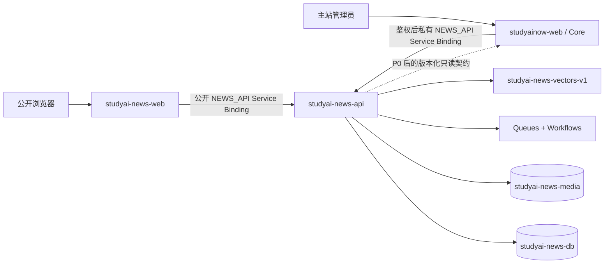
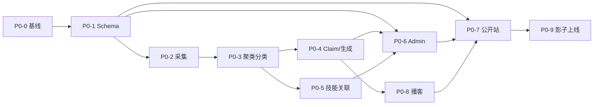

# news.studyai.now Codex 开发计划

> 状态：P0-5 工程范围已完成并部署；100 篇人工标注相关性评测待建立数据集；等待用户指令开始 P0-6
>
> 编制日期：2026-09-03
>
> P0-0 验收记录：[`P0-0_RELEASE_REPORT.zh-CN.md`](./P0-0_RELEASE_REPORT.zh-CN.md)
>
> P0-1 验收记录：[`P0-1_RELEASE_REPORT.zh-CN.md`](./P0-1_RELEASE_REPORT.zh-CN.md)
>
> P0-2 验收记录：[`P0-2_RELEASE_REPORT.zh-CN.md`](./P0-2_RELEASE_REPORT.zh-CN.md)
>
> P0-3 验收记录：[`P0-3_RELEASE_REPORT.zh-CN.md`](./P0-3_RELEASE_REPORT.zh-CN.md)
>
> P0-4 验收记录：[`P0-4_RELEASE_REPORT.zh-CN.md`](./P0-4_RELEASE_REPORT.zh-CN.md)
>
> P0-5 验收记录：[`P0-5_RELEASE_REPORT.zh-CN.md`](./P0-5_RELEASE_REPORT.zh-CN.md)
>
> Git 根：`/Users/aibao/Documents/Project/AI-course/studyainow/Code`
>
> 前端：`studyai-news-web`
>
> 后端：`studyai-news-api`

## 1. 初始规划结论（2026-09-03）

计划编制轮只完成了 PRD 阅读、现状审计、目录边界和 Codex 执行计划；P0-0 已在后续经用户确认后实施，结果见验收记录。

工作区、当前 Git 历史和全部本地分支中均未发现已有的 `news.studyai.now`、`studyai-news-web`、`studyai-news-api` 或 `/admin/news` 实现。因此没有可安全移动的 News 源代码。本轮创建两个空项目边界，以后所有 News 代码分别进入：

```text
studyainow/Code/
├── studyai-news-web/       # studyai-news-web Worker：仅公开 News 站
├── studyai-news-api/       # studyai-news-api Worker：API + 数据 + 工作流
└── docs/news/              # 版本化计划、契约说明、运行与验收记录
```

原始 PRD 保持在 `studyainow/PRD/News/`，没有复制或移动，避免形成两个内容不一致的 PRD 权威源。

## 2. 已核实的本地现状

### 2.1 Git 与工作区

| 项目 | 已核实状态 | 对 News 的影响 |
|---|---|---|
| 真实 Git 根 | `studyainow/Code` | 两个 News 项目由同一父仓库版本管理 |
| P0-0 开发分支 | `feat/news-p0-foundation`，已推送至 `origin` | News 规划、API、Web 使用独立原子提交；未混入 Jobs 改动 |
| 主工作区未提交改动 | `functions/_lib/jobs.ts`、`scripts/verify-job-presentation.ts`、`src/worker.ts`、`migrations/0043_publish_complete_official_job_descriptions.sql` | 视为已有 Jobs 工作；不得移动、覆盖或混入 News 提交 |
| 其他工作树 | `Code-course15-locales`、`Code-curriculum-reliability` | 是同一仓库的课程发布工作树，不是 News 代码，不做整理 |
| News 历史代码 | 当前文件、Git 历史、本地分支均未找到 | 从明确脚手架开始，不做来源不明的拼接 |

### 2.2 现有 StudyAINow 能力

现有主站不是空白项目。它已经具备：

- React 19 + Vite 前端和 `studyainow-web` Cloudflare Worker；
- D1 `studyainow-db`、R2 `studyainow-storage`、Workers AI 与职位 Vectorize；
- 用户注册/登录、Google OAuth、7 天 Session、Admin、Organization/Leader；
- 课程、章节、学习进度、职位、JD 技能证据、技能/别名/关系、课程技能覆盖；
- Stripe 捐赠基础、Resend 邮件、管理审计和多项验证脚本。

但下列能力不能假设已经可直接复用：

- `studyainow_session` 是 host-only Cookie，没有 `Domain=.studyai.now`；浏览器访问 `news.studyai.now` 时不会自动携带；
- 当前没有面向 News 的 SSO 授权码、`/entitlements`、技能/课程只读服务契约；
- 当前没有 News D1 表、来源抓取、Claim Ledger、文章发布、播客或 News Admin；
- 当前 Stripe 实现主要是捐赠流程，不等于订阅、退款、权益和 Customer Portal 已完成。

因此 P0 不应直接复制用户表、复用主站 Cookie或让 News Worker写入 `studyainow-db`。

## 3. 已确定的工程边界

### 3.1 单一 Git 仓库，不建立嵌套仓库

推荐并已建立的本地边界是：

- 保留 `studyainow/Code/.git` 为唯一 Git 根；
- `studyai-news-web` 和 `studyai-news-api` 是同仓库的两个独立 Node/Worker 项目；
- 每个项目有自己的 `package.json`、lockfile、TypeScript 配置、Wrangler 配置、测试和部署命令；
- 不在子目录运行 `git init`，不使用未配置远端的嵌套仓库，也不在此阶段引入 submodule；
- PRD 仍是仓库外的产品输入；本计划、API 契约、迁移、Runbook 和验收证据进入父仓库版本管理。

原因：两个 Worker需要独立部署和回滚，但它们共享一次产品变更、API 契约和审查节奏；当前也没有两个独立远端仓库可供安全拆分。

### 3.2 Worker 运行边界



`studyai-news-web`：

- 对外承接 `news.studyai.now`；
- 建议使用 Astro + React Islands，公共内容以 SSR/预渲染 HTML 输出；
- 不提供独立后台；`/admin/news*` 永久重定向到 `studyai.now/admin/news*`；
- 只转发 `/api/news/v1/*`，明确拒绝在公开 News 主机上转发 `/api/admin/news/*`；
- 不直接绑定 News D1、R2、Queues、Workflows 或 Vectorize。

`studyai-news-api`：

- 建议使用 TypeScript + Hono；
- 只通过 Service Binding 被 Web Worker调用，不另开第二个公共 API 域名；
- 独占 News D1 schema、R2、Queues、Workflows、Vectorize 和 Workers AI；
- 管理来源、候选、故事、Claim、草稿、修订、审批、发布、纠错、播客和审计；
- 不直接写 `studyainow-db`。

Service Binding 可保持同源 API、避免浏览器 CORS，并允许 Worker 独立发布。根据用户在 P0-4 的明确调整，`studyainow-web` 先验证 host-only 主站 Session 与 `admin` 角色，再以独立服务密钥和可审计的主站用户 ID 调用私有 News API；浏览器 Cookie、Authorization 和服务密钥都不跨越错误的边界。

### 3.3 P0 身份边界

P0 使用现有 `studyai.now/admin/*` 主站身份边界保护唯一的 News 后台。主 Worker 只接受同源 CSRF 信号并通过私有 Service Binding 转发；News API 只接受服务凭证或非浏览器运维 Bearer，审计 actor 使用主站管理员 ID。禁止把长期 Cookie 扩展到整个 `.studyai.now`，也禁止 News 公开主机暴露管理 API。

P0-6 再补充分角色权限（Viewer、Researcher、Editor、Publisher、Admin）、高风险双人审核和可选 Cloudflare Access 纵深防御。

### 3.4 数据边界

建议创建独立 News 资源，名称在部署前由用户确认：

| 类型 | 推荐生产名称 | 责任 |
|---|---|---|
| D1 | `studyai-news-db` | News 内容、工作流、审核、订阅域数据 |
| R2 | `studyai-news-media` | 限权快照、封面、音频、转写和导出 |
| Vectorize | `studyai-news-vectors-v1` | 故事去重、相关文章、技能候选召回 |
| Queue | `studyai-news-ingest` | 来源发现与抓取缓冲 |
| Queue | `studyai-news-enrichment` | 分类、Claim、技能关联任务 |
| Queue | `studyai-news-media` | TTS 与媒体任务 |
| DLQ | `studyai-news-dlq` | 达到重试上限的消息 |

`skill_id`、`course_id`、`user_id` 和 `organization_id` 只保存 StudyAINow Core 的规范 ID。新闻侧只保存关联、证据、分数、来源版本和审核状态。

## 4. Git 与版本管理规则

### 4.1 分支

在开始编码前先处理当前主工作区的 Jobs 未提交改动：由其原任务提交/暂存，或明确保留并只精确提交 News 路径。不要用 `git reset --hard`、`git restore .` 或全量 `git add .`。

News 分支建议：

```text
feat/news-p0-foundation
feat/news-p0-ingestion
feat/news-p0-editorial
feat/news-p0-publication
feat/news-p1-growth
feat/news-p2-community
```

若多人并行，使用独立 Git worktree，但临时 worktree 不作为最终代码目录；合并后代码仍只位于两个指定目录。

### 4.2 提交

推荐 Conventional Commit scope：

```text
docs(news): ...
chore(news-web): ...
feat(news-web): ...
test(news-web): ...
chore(news-api): ...
feat(news-api): ...
fix(news-api): ...
test(news-api): ...
```

每个提交只完成一个可回滚目标。禁止把现有 Jobs/Course 未提交改动带入 News 提交。

### 4.3 迁移与契约

- News D1 迁移只存在于 `studyai-news-api/migrations/`，从 `0001` 开始，已发布迁移不改写；
- 每次 schema 变化先在空本地 D1 重放全部迁移，再跑升级路径和外键检查；
- `studyai-news-api/openapi/news-api.yaml` 作为 HTTP API 权威契约；
- Web 端类型由契约生成并验证，不维护第二份手写 DTO；
- StudyAINow Core 集成使用单独的版本化只读契约，并有契约测试；
- Prompt 模板、模型路由和评测版本进入 Git，密钥和真实受限源快照不进入 Git。

### 4.4 不进入 Git 的内容

- `.dev.vars*`、`.env*`、Token、API Key、Access 凭据；
- `node_modules`、`dist`、`.astro`、`.wrangler`、测试浏览器缓存；
- 本地 D1/SQLite、SQL 导出、备份；
- 抓取的第三方全文、受限快照、生成音频和大模型原始生产输出；
- 未经授权的图片、声音样本或课程正文。

## 5. P0 范围：先交付可信的内容生产闭环

推荐 P0 对原 PRD 做如下收口：

- 中文 UI 与中文发布为第一语言；可以采集中英文一手来源；英文公开内容放入 P1；
- 所有公开内容都必须人工批准，不做任何自动发布；
- 先打通 10 个来源的纵向闭环，再扩到 30–50 个来源；
- 免费内容优先，不做账号、收藏、付费墙、Stripe 和邮件广播；
- 保留 RSS、基础 SEO、日报、深度文章和周播客，因为它们是内容产品的基本可验证输出；
- Admin 完全放在 `studyai.now/admin/news` 的现有管理信息架构内；`news.studyai.now` 只承载公开站；
- P0 技能/课程关系可先使用经人工导入的只读规范快照，正式实时契约最晚在上线 Gate 前完成。

### P0-0：仓库与双 Worker 基线

状态：**已完成（2026-09-03）**。Staging 与 Production 均已部署并完成远程回归，详见 P0-0 验收记录。

- 输出：两个独立项目脚手架、固定 Node 版本、`wrangler.jsonc`、dev/staging/prod 配置、Web→API Service Binding、健康检查、OpenAPI 骨架。
- 测试：各项目 typecheck/build；本地双 Worker连通；Web `/api/news/v1/health` 返回 API 版本与 trace ID；生产配置 dry-run 不包含秘密值。
- 回滚：删除两个新项目路径即可，不影响主站。

### P0-1：News schema 与发布状态机

状态：**已完成（2026-09-03）**。独立 Staging/Production D1、空库迁移重放、发布状态机、审批门禁和远程回归均已通过，详见 P0-1 验收记录。

- 输出：来源、游标、source item/snapshot、story cluster、Claim/evidence、article/revision、taxonomy、skill/course link、workflow run、audit/idempotency、podcast/media 表。
- 测试：从 `0001` 在空 D1 全量重放；约束/索引/外键测试；状态非法跳转被拒绝；迁移升级与回滚说明完整。
- Gate：数据库中不存在复制的 StudyAINow 用户、课程或技能主表。

### P0-2：安全采集垂直切片

状态：**已完成（2026-09-03）**。10 个一手官方 Feed、合规来源审计、受限采集、增量游标、私有 R2 快照、解析器版本重处理、来源管理 API、Staging/Production 实采与远程回归均已通过，详见 P0-2 验收记录。

- 输出：来源 CRUD、RSS/Atom connector、调度、ETag/Last-Modified、URL canonical、正文抽取、R2 限权快照、失败重试和来源健康。
- 测试：SSRF 内网/元数据地址、重定向绕过、超时、超大正文、重复 URL、无效 XML、源站 429/5xx；10 个来源连续增量。
- Gate：只接入已记录许可/用途的一手来源；第三方全文不出现在公开 API。

### P0-3：去重、分类与实体

状态：**已完成（2026-09-03）**。除原计划的聚类、分类与实体外，根据用户要求提前交付基础编辑、人工审核、上架/下架、内容修订和分类标签管理，并接入主站 `/admin/news`。详见 P0-3 验收记录。

- 输出：SimHash/规范 URL 去重、事件簇、有限一级分类、标签别名、实体规范化、人工锁定字段。
- 测试：固定样本上的重复故事率、Macro-F1、标签相关率、实体合并；批量重跑不覆盖人工锁定。
- Gate：模型不能创建新的一级分类。

### P0-4：Claim Ledger 与来源约束生成

状态：**已完成（2026-09-03）**。Research Package、Claim/evidence 不可变账本、来源覆盖门禁和人工审核链路均已部署；同时取消 News 子域独立后台，将全部管理功能移入主站统一后台。详见 P0-4 验收记录。

- 输出：研究包、原子 Claim、证据、冲突/未验证状态、Prompt Registry、模型/成本/输入 hash 记录、快讯草稿。
- 测试：数字、日期、引语和价格必须有 Claim；Prompt 注入样本；结构化输出失败与降级；相同输入幂等复用。
- Gate：无来源的新事实导致草稿失败或回到人工队列。

### P0-5：技能/课程只读关联

状态：**工程范围已完成并部署（2026-09-04）**。Core 只读目录契约、关键词与 Vectorize 混合召回、可审计建议、统一后台审核、公共新闻站及主站新闻导航均已上线；100 篇人工标注集尚未建立，因此 Precision@5 / Recall@10 数值 Gate 保持待验收。详见 P0-5 验收记录。

- 输出：Core 数据快照/契约、关键词 + Vectorize 召回、重排、证据、阈值和审核队列。
- 测试：人工标注集 Precision@5、Recall@10；无效/合并/禁用 ID；Core 不可用时降级；阅读新闻绝不写成“掌握技能”。
- Gate：向量结果只产生建议，正式关系必须可审、可撤回、可重算。

### P0-6：统一 `/admin/news` 的高级编辑闭环

- 说明：P0-4 已将基础管理功能实装到 `studyai.now/admin/news`，并取消子域独立后台；本阶段仍负责正式 RBAC、高风险双人审核、版本对比/预览、自动保存、完整失败恢复与可选 Access 纵深防御。
- 输出：Dashboard、Sources、Candidates、Story/Claim、Articles、Skill Review、Workflow/Audit；自动保存、版本对比、预览、批准、排期、撤回、纠错。
- 测试：Access JWT/RBAC、越权、CSRF、并发编辑、幂等发布、失败重试、敏感快照字段过滤；桌面与 390 px 视觉回归。
- Gate：生成者不能绕过 Publisher 角色直接发布，高风险内容支持第二审核人规则。

### P0-7：公开站与基础 SEO

- 输出：首页、日报列表/日期页、文章、分类、标签、播客、搜索、About/编辑原则、Corrections；canonical、OG、基础 JSON-LD、sitemap 和 RSS。
- 测试：无 JS 可读正文/来源/转写；草稿和撤回内容不可见；404/500/空状态；结构化数据；键盘/读屏；390 px 无横向溢出。
- Gate：公开请求不调用大模型；已发布内容经过 Cache API/CDN，纠错能失效旧缓存。

### P0-8：播客生产与播放器

- 输出：审核文章→脚本→发音预览→分段 TTS→拼接/响度→章节/转写→R2；HTML5 Audio、倍速、进度恢复、Media Session。
- 测试：单段重试、缺段/乱序、Range Request/MIME、Safari/Chrome/Edge、移动浏览器、无音频降级到转写。
- Gate：未批准稿件不能进入公开 R2 key 或公开 RSS。

### P0-9：影子运行与上线

- 输出：30–50 个来源、20 条金标准、至少 100 条候选、10 篇深度稿、5 集音频、监控/告警、备份恢复、密钥轮换、回滚与运营 Runbook。
- 测试：7 天影子运行；来源失效、Queue 积压、模型超时、R2 失败、重复发布、错误撤回和重大纠错演练。
- Go/No-Go：Sev-1/2 为 0；工作流最终成功率 ≥98%；关键 Claim 覆盖 100%；发布/撤回/纠错可恢复；性能、无障碍和移动端通过。

P0 依赖顺序：



## 6. P1 范围：增长、统一账户与商业化

P1 在 P0 稳定运行后按以下顺序实施：

1. **P1-1 深化 SEO 与英文内容**：中英 locale、真实 hreflang、按类型拆分 sitemap、主题集群、内容老化/重定向、索引监控。
2. **P1-2 StudyAINow SSO**：短时授权码、News host-only Session、登出/撤销、`/me`、账号删除；不共享跨子域长期 Cookie。
3. **P1-3 收藏/阅读/播放进度**：匿名本地状态、登录后的明确合并、跨设备冲突策略与隐私偏好。
4. **P1-4 Entitlement 与付费墙**：统一权益查询、服务端正文裁剪、缓存隔离和越权 E2E。
5. **P1-5 邮件与 RSS 扩展**：CASL 所需同意、double opt-in、主题偏好、退订/抑制、日报广播、分类/技能/私有 Podcast feed。
6. **P1-6 Stripe 商业闭环**：复用 StudyAINow Stripe Customer/产品，Checkout、Webhook 幂等/乱序、Portal、退款/取消、对账与权益回收。
7. **P1-7 持久播放器与列表**：跨路由播放、自动/自定义队列、稍后收听、历史与跨设备进度。
8. **P1-8 Leader 基础版**：Leader 推荐文章/课程/练习、组织周报、成员通知偏好和最小统计。

P1 上线 Gate：认证/权益契约测试通过；会员全文不能由 HTML、API、RSS、缓存或搜索索引泄露；支付/退款/退订能端到端对账。

## 7. P2 范围：社群、专家与分发网络

1. **P2-1 社群验证**：先用混合/SaaS 方式验证讨论需求；站内只保存授权摘要和深链。
2. **P2-2 自建治理基础**：若验证成立，再实现 Space、帖子、回复、举报、审核、封禁、申诉、限速和反垃圾。
3. **P2-3 专家入驻**：身份/领域核验、试稿、协议、利益披露、署名、投稿和单一结算模型。
4. **P2-4 VIP 讨论与活动**：服务端权益、提问/AMA/活动/回放；私密内容禁止索引、RSS、公开 AI 输入和误分发。
5. **P2-5 分发 Adapter**：已批准版本→平台草稿→人工预览→发布；幂等、凭据最小权限、纠错/撤稿追踪和归因。
6. **P2-6 播客平台**：标准 RSS 为唯一事实源，平台认领与收录监控；没有官方 API 时只生成分发包，不做模拟登录。

P2 上线 Gate：治理流程、平台授权、专家协议、隐私/版权边界和撤稿演练全部完成。

## 8. Codex 执行协议

用户确认后，Codex 按单一里程碑推进，而不是一次生成整个系统：

1. 开始每个里程碑前记录 `git status --short`、当前分支、目标文件和不做范围。
2. 每个 Ticket 先写或更新验收测试，再实现最小纵向切片。
3. 只编辑该 Ticket 允许的目录；跨边界改动先在进度说明中列出原因和影响。
4. 每个函数/迁移完成后跑聚焦测试；每个里程碑完成后跑 typecheck、unit、integration 和必要 E2E。
5. UI 必须由 Codex 亲自检查桌面和 390 px 截图；API 要展示真实响应；部署要记录 Worker版本和远端资源状态。
6. Cloudflare schema 先本地空库重放，再 staging 远端迁移，再部署依赖代码；production 需要对应 Gate。
7. 每个阶段提交小而可回滚的 commit；不得使用全量 add、硬重置或覆盖已有工作。
8. 完成一个里程碑后报告“源代码验证、本地运行、staging、production”分别达到哪一级，不能把 build 当作上线证据。
9. 遇到外部权限、供应商选择、法务/版权或会改变范围的决策时暂停，请用户确认。
10. P0-9 Go/No-Go 前不宣布 P0 完成；P1/P2 不因 UI 壳存在而视为已交付。

每个 Ticket 使用统一格式：

```text
Ticket: NEWS-P0-xxx
目标：一个可观察业务结果
允许修改：精确目录/文件
不做：本 Ticket 明确排除项
输出：代码、契约、迁移、文档
验证：命令、API 响应、E2E/截图、远端证据
监控：指标、日志、trace、告警
回滚：代码、schema、队列/缓存处理
```

## 9. Definition of Done

功能只有同时满足以下条件才完成：

- 需求、异常路径和不做范围明确；
- API/schema/Prompt 有版本和兼容策略；
- 单元、集成、必要 E2E、权限和安全测试通过；
- UI 有加载、空、错误、404、无权限和移动状态；
- 日志、trace、指标、失败重试、幂等和审计可用；
- 版权、来源、隐私、AI 披露和纠错要求完成；
- staging 迁移/部署/真实路径验证完成；
- production 变更有远端版本、资源、路由和回滚证据；
- Runbook 和操作说明已更新；
- 对应产品/内容 Gate 已得到人工确认。

## 10. 需要用户确认的推荐决策

开发前请一次确认以下默认方案：

1. 采用父仓库单一 Git 边界，不为两个子目录创建独立仓库；
2. 前端使用 Astro + React Islands，后端使用 TypeScript + Hono；
3. Web Worker通过 `NEWS_API` Service Binding 调用 API Worker，API 不另开公共域名；
4. P0 使用 Cloudflare Access 保护编辑后台，P1 再接统一 StudyAINow SSO；
5. News 使用独立 D1/R2/Vectorize/Queues，不直接写 `studyainow-db`；
6. P0 中文发布、采集中英文来源，英文公开版本进入 P1；
7. P0 全部内容人工批准；首个纵向切片 10 个来源，P0 Gate 扩到 30–50 个；
8. 按 P0-0 开始，逐里程碑实现、验证、提交并等待下一阶段确认。

若无调整，用户可回复：**“按推荐方案执行 P0-0。”**

## 11. 依据

- `studyainow/PRD/News/news-studyai-now-competitor-analysis-prd-zh.md`
- `studyainow/PRD/News/news-studyai-now-project-implementation-plan-zh.md`
- 当前 `studyainow/Code` 源码、D1 迁移、`package.json`、`wrangler.toml`、Git 状态和本地 worktree 状态
- Cloudflare 官方资料：
  - https://developers.cloudflare.com/workers/runtime-apis/bindings/service-bindings/
  - https://developers.cloudflare.com/workflows/
  - https://developers.cloudflare.com/queues/
  - https://developers.cloudflare.com/workers/wrangler/configuration/
